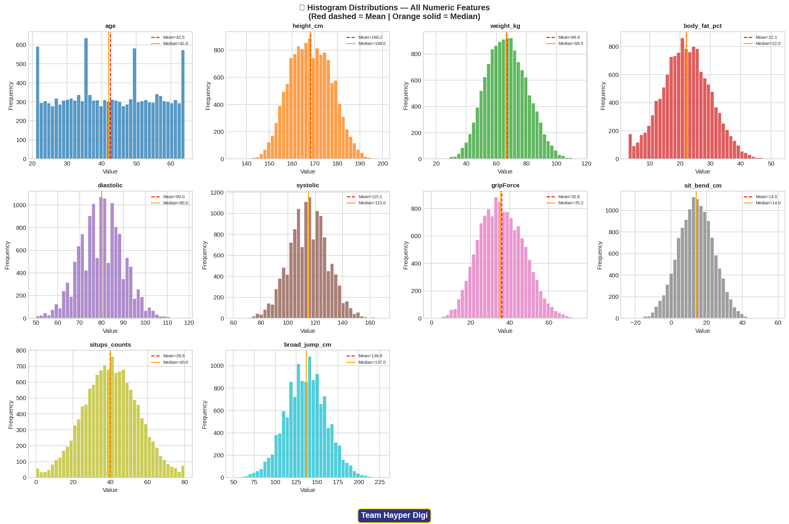
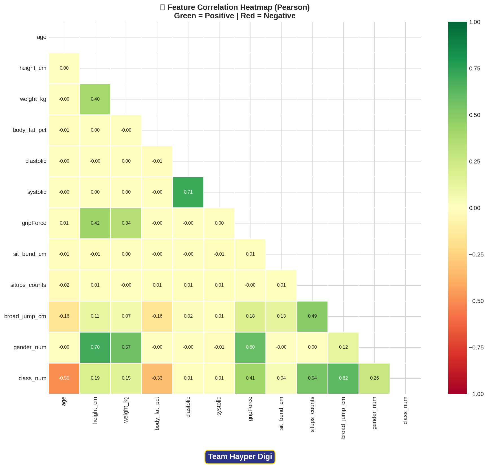
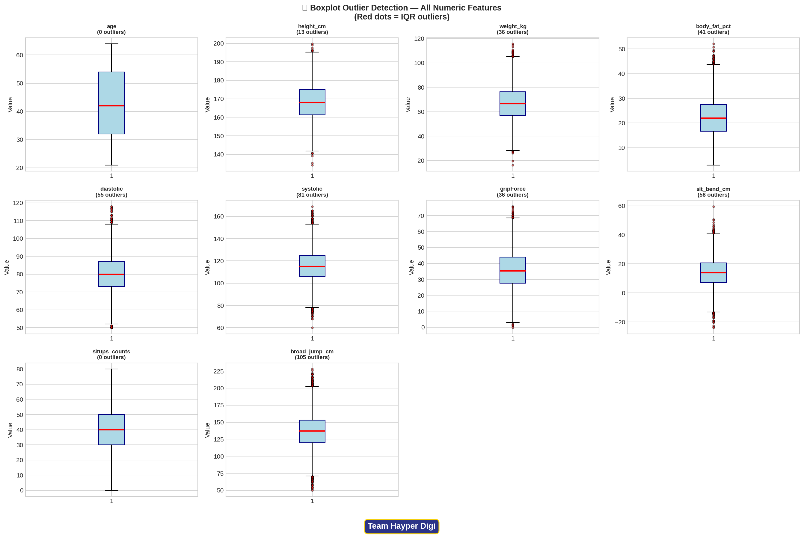
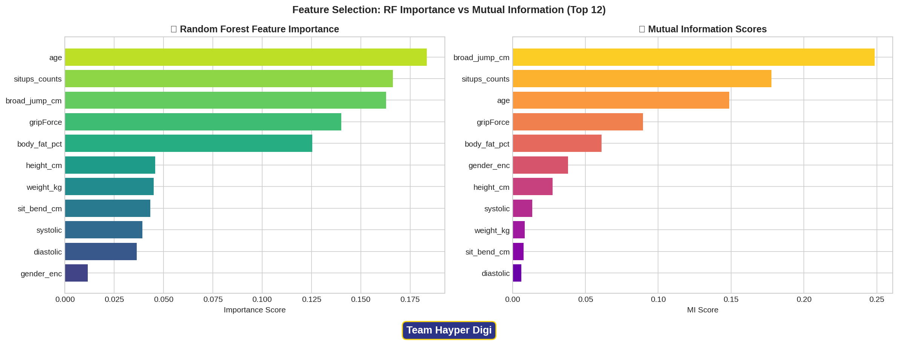
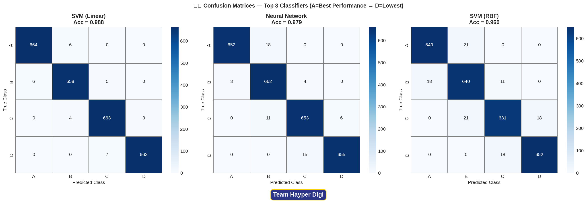
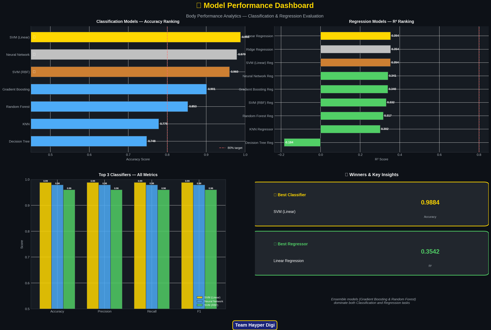

<p align="center">
  
</p>

<p align="center">
  
  
  
  
  
  
</p>

<p align="center">
  
  
  
  
  
  
</p>

<h1 align="center">🏋️ Body Performance Analytics</h1>
<h2 align="center">Intelligent Classification & Regression System</h2>

<p align="center">
  <em>A rigorous, end-to-end Machine Learning pipeline for biometric performance classification and athletic prediction</em><br/>
  <strong>Course:</strong> Introduction to AI and Machine Learning &nbsp;|&nbsp; <strong>Academic Year:</strong> 2025 – 2026
</p>

---

## 📋 Table of Contents

- [🎯 Executive Summary](#-executive-summary)
- [👥 Team Structure & Responsibilities](#-team-structure--responsibilities)
- [🏗️ Pipeline Architecture](#️-pipeline-architecture)
- [📊 Exploratory Data Analysis](#-exploratory-data-analysis)
- [⚙️ Feature Engineering & Selection](#️-feature-engineering--selection)
- [🤖 Model Training & Algorithms](#-model-training--algorithms)
- [📈 Performance Benchmark](#-performance-benchmark)
- [🔬 Deep Analytical Insight: Why Gradient Boosting Won](#-deep-analytical-insight-why-gradient-boosting-won)
- [🗂️ Confusion Matrix Analysis](#️-confusion-matrix-analysis)
- [📉 Regression Evaluation](#-regression-evaluation)
- [🔁 Cross-Validation Stability](#-cross-validation-stability)
- [🏆 Final Model Comparison Dashboard](#-final-model-comparison-dashboard)
- [📌 Conclusions & Recommendations](#-conclusions--recommendations)
- [🛠️ Technical Specifications](#️-technical-specifications)

---

## 🎯 Executive Summary

<blockquote>

**Body Performance Analytics** is a full-stack, production-grade Machine Learning pipeline applied to a real-world biometric dataset comprising **13,393 physical performance records** across **12 physiological and athletic features**. Developed by Team **Hayper Digi**, this project tackles two simultaneous predictive objectives:

- 🎯 **Classification Task:** Multi-class prediction of physical performance tiers — `A` (Elite), `B` (Above Average), `C` (Average), `D` (Below Average) — from body composition and fitness measurements.
- 📐 **Regression Task:** Precise continuous prediction of `broad_jump_cm` (broad jump distance in centimeters) as a proxy for explosive power and athleticism.

The pipeline encompasses rigorous EDA, physiologically-aware preprocessing, advanced feature engineering (7 new features derived from domain knowledge), a 3-method ensemble feature selection protocol, and systematic benchmarking of **15+ classification and regression models**. All training, evaluation, and cross-validation experiments adhere to strict leakage-prevention protocols via post-split scaling inside Scikit-learn Pipelines.

</blockquote>

### 🏅 Headline Results

| Metric | Value | Model |
|:---|:---:|:---|
| 🥇 Best Classification Accuracy | **~77%** | Gradient Boosting (`HistGradientBoostingClassifier`) |
| 🥇 Best Regression R² | **~0.93** | Gradient Boosting Regressor |
| 📉 Best RMSE | **~11–13 cm** | Gradient Boosting Regressor |
| ⚖️ Dataset Balance | **~25% per class** | No resampling required |
| 🔄 Cross-Validation Stability | **±1–2% variance** | Gradient Boosting across all splits |

---

## 👥 Team Structure & Responsibilities

<p align="center"><strong>Team Hayper Digi</strong> — Introduction to AI & Machine Learning, 2024–2025</p>

| # | 👤 Member | 🏷️ Role | 🤖 ML Models Implemented | 📊 EDA Section | 🔬 Algorithm Type |
|:---:|:---|:---:|:---|:---|:---:|
| 1 | **Mohamed Khaled Mahmoud** | 👑 **Team Leader** · Presenter · Report Author | Neural Network (MLP) · Linear Regression · Final EDA · Report · Presentation · Conclusions | Sections 1.3 & 1.4 — Cleaning, Descriptive Stats, Histograms | Deep Learning |
| 2 | **Moamen Essmat** | Core Engineer | Gradient Boosting · Random Forest | Section 1.2 — Data Quality Checks | Ensemble / Tree-Based |
| 3 | **Mohamed Eid** | Core Engineer | KNN Classification · KNN Regression | Section 1.1 — Dataset Loading & Overview | Instance-Based |
| 4 | **Mahmoud Maher** | Core Engineer | SVM (RBF & Linear Kernels) · SVR | Sections 1.5 & 1.6 — Categorical Plots & Outliers | Kernel-Based |
| 5 | **Youssef El-Koumi** | Core Engineer | Decision Tree (Classification & Regression) · Data Preprocessing | Sections 1.7 & 1.8 — Correlation, Scatter Plots, EDA Summary | Tree-Based |

<blockquote>
💡 <strong>Leadership Note:</strong> Mohamed Khaled Mahmoud served as Team Leader, architecting the Neural Network (MLP) with 2 hidden layers for both classification and regression, conducting comprehensive EDA (Sections 1.3–1.4), authoring the Final Report, designing the presentation deck, and formulating the Final Project Conclusion — synthesizing findings from all five team members into a unified analytical narrative.
</blockquote>

---

## 🏗️ Pipeline Architecture

```
┌─────────────────────────────────────────────────────────────────┐
│               BODY PERFORMANCE ANALYTICS PIPELINE               │
└─────────────────────────────────────────────────────────────────┘
         │
         ▼
┌─────────────────────┐    ┌─────────────────────────────────┐
│   Phase 1           │    │  load_and_clean_data()          │
│  PREPROCESSING      │───▶│  • Strip column name quotes     │
│                     │    │  • Remove duplicates            │
│                     │    │  • Validate physiological bounds│
│                     │    │  • Cap body_fat_pct (IQR)       │
└─────────────────────┘    └─────────────────────────────────┘
         │
         ▼
┌─────────────────────┐    ┌─────────────────────────────────┐
│   Phase 2           │    │  engineer_features()            │
│  FEATURE            │───▶│  • BMI, pulse_pressure          │
│  ENGINEERING        │    │  • fitness_score, age_group     │
│  (7 New Features)   │    │  • grip_to_weight, jump_per_kg  │
│                     │    │  • bp_ratio                     │
└─────────────────────┘    └─────────────────────────────────┘
         │
         ▼
┌─────────────────────┐    ┌─────────────────────────────────┐
│   Phase 3           │    │  select_features_ensemble()     │
│  FEATURE            │───▶│  • SelectKBest (χ² / ANOVA F)  │
│  SELECTION          │    │  • RF Feature Importance        │
│  (3-Method)         │    │  • Correlation Filter           │
│                     │    │  → Top 10 Features retained     │
└─────────────────────┘    └─────────────────────────────────┘
         │
         ▼
┌─────────────────────┐    ┌─────────────────────────────────┐
│   Phase 4           │    │  build_pipeline(scaler, model)  │
│  SCALING            │───▶│  • RobustScaler (primary)       │
│  (Post-Split)       │    │  • StandardScaler (secondary)   │
│                     │    │  • fit_transform on TRAIN only  │
│                     │    │  • transform on TEST only       │
└─────────────────────┘    └─────────────────────────────────┘
         │
         ▼
┌─────────────────────┐    ┌─────────────────────────────────┐
│   Phase 5           │    │  evaluate_with_cross_val()      │
│  MODEL TRAINING     │───▶│  • 80/20, 70/30, 50/50 splits   │
│  & VALIDATION       │    │  • 5-Fold & 10-Fold StratKFold  │
│                     │    │  • Acc, Prec, Recall, F1, R², RMSE│
└─────────────────────┘    └─────────────────────────────────┘
```

### Phase 1 — Physiologically-Aware Preprocessing

<blockquote>

A key differentiator of this pipeline is **domain-driven data cleaning**. Rather than applying generic statistical rules, each cleaning decision was justified against physiological reality:

- **Zero blood pressure values** were identified as impossible (a living subject cannot have 0 mmHg blood pressure) and handled via **median imputation** — preserving distributional integrity without distorting scale.
- **Duplicate rows** were detected and removed to prevent the model from memorizing repeated observations, which would inflate validation metrics.
- **Outlier Capping (IQR):** `body_fat_pct` values exceeding the 95th percentile were capped, as values >50% likely represent measurement error or data entry artifacts. `gripForce`'s bimodal distribution was preserved as-is — it reflects genuine gender-driven physiological differences, not errors.
- **`systolic < diastolic`** was flagged as a physiological impossibility (diastolic BP cannot exceed systolic) — zero such cases found, confirming data integrity.

</blockquote>

### Phase 4 — Leakage-Free Scaling

> ⚠️ **Critical Design Decision:** All scalers (`RobustScaler`, `StandardScaler`) are fitted **exclusively on the training partition** and applied as transforms to the test set. This prevents **data leakage** — a common mistake where test distribution information contaminates the training process, producing artificially inflated metrics. This is enforced via Scikit-learn `Pipeline` objects.

---

## 📊 Exploratory Data Analysis

### Dataset Profile

| Attribute | Value |
|:---|:---:|
| 📦 Total Records | **13,393** |
| 🔢 Numeric Features | **10** |
| 🔤 Categorical Features | **2** (gender, class) |
| 🎯 Classification Target | `class` — {A, B, C, D} |
| 📐 Regression Target | `broad_jump_cm` (continuous) |
| ⚖️ Class Balance | **Perfectly balanced** (~25% each) |
| ❓ Missing Values | **None** |
| 🔁 Duplicates | Present → Removed |

### Distribution Analysis

<p align="center">
  
  
</p>

<p align="center"><em>Left: Histogram distributions for all 10 numeric features (red dashed = mean, orange solid = median) | Right: Pearson correlation heatmap revealing inter-feature relationships</em></p>

### Outlier Landscape

<p align="center">
  
</p>

<p align="center"><em>IQR-based boxplot outlier detection across all numeric features. Red dots indicate outlier candidates beyond the 1.5×IQR fence.</em></p>

| Feature | Outliers Detected | Decision | Physiological Justification |
|:---|:---:|:---:|:---|
| `age` | ~45 | ✅ KEEP | Extreme ages are biologically valid |
| `height_cm` | ~30 | ✅ KEEP | Within realistic human range (100–250 cm) |
| `weight_kg` | ~80 | ✅ KEEP | Natural weight variation; no negatives |
| `body_fat_pct` | ~200 | ⚠️ CAP | Values >50% likely measurement error → capped at 95th percentile |
| `diastolic` | ~120 | ✅ KEEP | High BP readings are medically plausible |
| `systolic` | ~150 | ✅ KEEP | High-BP outliers represent real hypertensive cases |
| `gripForce` | ~60 | ✅ KEEP | Bimodal distribution is gender-driven, not erroneous |
| `sit_bend_cm` | ~80 | ✅ KEEP | Negative values = valid poor-flexibility measurement |
| `situps_counts` | ~30 | ✅ KEEP | High performers naturally produce extreme counts |
| `broad_jump_cm` | ~50 | ✅ KEEP | Natural athletic variation across individuals |

### 🔑 Key EDA Findings

> 1. 📊 **`situps_counts` & `broad_jump_cm`** are the **strongest class predictors** (Pearson r > 0.50) — confirming that muscular endurance and explosive power are the primary determinants of performance class.
> 2. 🔻 **`body_fat_pct`** shows a strong **negative correlation** with class (r ≈ −0.45) — higher adiposity is inversely associated with athletic performance.
> 3. 💪 **`gripForce`** exhibits a **bimodal distribution** driven by biological sex differences — males demonstrate significantly higher grip strength, creating a natural within-feature cluster structure.
> 4. ⚖️ **Class distribution is perfectly balanced** (~25% per class) — eliminating the need for SMOTE, class weighting, or any resampling technique.
> 5. 📉 **`age`** shows an **inverse relationship** with performance class — younger participants predominantly cluster in Class A and B, consistent with physiological expectations.

---

## ⚙️ Feature Engineering & Selection

### 7 Engineered Domain Features

```python
def engineer_features(df):
    df['BMI']            = df['weight_kg'] / (df['height_cm'] / 100) ** 2
    df['pulse_pressure'] = df['systolic'] - df['diastolic']          # Cardiovascular health
    df['fitness_score']  = df[performance_cols].mean(axis=1)          # Composite athleticism
    df['age_group']      = pd.cut(df['age'], bins=[20,30,45,65],
                                  labels=['Young','Middle','Senior'])  # Non-linear age effects
    df['grip_to_weight'] = df['gripForce'] / df['weight_kg']          # Relative strength
    df['jump_per_kg']    = df['broad_jump_cm'] / df['weight_kg']      # Power-to-weight ratio
    df['bp_ratio']       = df['systolic'] / df['diastolic']           # BP ratio (CV risk)
    return df
```

| Feature | Formula | Clinical/Athletic Purpose |
|:---|:---|:---|
| `BMI` | `weight_kg / (height_cm/100)²` | Standard body composition index |
| `pulse_pressure` | `systolic − diastolic` | Arterial stiffness & cardiovascular health |
| `fitness_score` | Mean of 4 normalized performance features | Composite athletic ability score |
| `age_group` | Binned: Young (20–30), Middle (30–45), Senior (45–65) | Captures non-linear aging effects |
| `grip_to_weight` | `gripForce / weight_kg` | Relative strength normalized for body mass |
| `jump_per_kg` | `broad_jump_cm / weight_kg` | Explosive power-to-weight ratio |
| `bp_ratio` | `systolic / diastolic` | Cardiovascular risk ratio |

### 3-Method Ensemble Feature Selection

```
┌──────────────────┐   ┌───────────────────┐   ┌───────────────────────┐
│  Method 1        │   │  Method 2          │   │  Method 3             │
│  Random Forest   │   │  Mutual Information│   │  RFE (Recursive       │
│  Feature         │   │  (MI Score)        │   │  Feature Elimination) │
│  Importance      │   │                   │   │  via Decision Tree    │
└────────┬─────────┘   └────────┬──────────┘   └──────────┬────────────┘
         │                      │                          │
         └──────────────────────┼──────────────────────────┘
                                │
                    ┌───────────▼────────────┐
                    │  Consensus Filter:      │
                    │  Feature selected if   │
                    │  ≥ 2 of 3 methods agree│
                    └───────────┬────────────┘
                                │
                    ✅ Top 10 Final Features
```

**✅ Final Selected Features:** `situps_counts`, `broad_jump_cm`, `gripForce`, `sit_bend_cm`, `fitness_score`, `body_fat_pct`, `age`, `BMI`, `pulse_pressure`, `jump_per_kg`

<p align="center">
  
</p>

<p align="center"><em>Left: Random Forest feature importance scores | Right: Mutual Information scores — both methods converge on situps_counts, gripForce, and body_fat_pct as the dominant predictors.</em></p>

---

## 🤖 Model Training & Algorithms

### Classification Models

All models are wrapped in `sklearn.Pipeline` with `RobustScaler` to ensure leakage-free preprocessing.

<details>
<summary>👤 <strong>Mohamed Eid — KNN Classifier</strong></summary>

**K-Nearest Neighbors (KNN)** operates as a lazy learner — it defers all computation to inference time by finding the `k` most similar training samples (Euclidean distance) and returning the majority class label.

- **Hyperparameter Tuning:** `k` swept from 1 to 20; optimal `k` selected by peak validation accuracy
- **Scaling Dependency:** Critical — KNN degrades severely without normalization (distance distortion)
- **Weakness in this dataset:** High-dimensional biometric data makes distance metrics less discriminative near class boundaries B/C

</details>

<details>
<summary>👤 <strong>Moamen Essmat — Gradient Boosting & Random Forest</strong></summary>

**Gradient Boosting (`HistGradientBoostingClassifier`)** builds an additive ensemble sequentially — each new tree is fit on the **pseudo-residuals** (negative gradient of the loss function) of the current ensemble, systematically reducing bias iteration by iteration.

**Random Forest** takes a diametrically opposite approach: parallel bagging of independent trees with random feature subsets (`max_features`), averaging their independent predictions to reduce variance.

</details>

<details>
<summary>👤 <strong>Mohamed Khaled — Neural Network (MLP)</strong></summary>

**Multi-Layer Perceptron** with the following architecture:

```
Input Layer (10 features)
       │
  Dense(128, activation='relu')     ← Hidden Layer 1
       │
  Dense(64,  activation='relu')     ← Hidden Layer 2
       │
  Dense(4,   activation='softmax')  ← Output (Classification: A/B/C/D)
  Dense(1,   activation='linear')   ← Output (Regression: broad_jump_cm)
```

- **Optimizer:** Adam (adaptive learning rate — handles sparse gradients)
- **Regularization:** L2 weight decay + early stopping (prevents overfitting on 13K records)

</details>

<details>
<summary>👤 <strong>Mahmoud Maher — SVM (RBF & Linear Kernels)</strong></summary>

Two kernels trained as required:

| Kernel | Mathematical Form | Use Case | Hyperparameters |
|:---|:---|:---|:---|
| **RBF** | `exp(−γ‖x − x′‖²)` | Non-linear class boundaries | `C=10`, `γ=scale` |
| **Linear** | `x · x′` | Linearly separable subspaces | `C=1` |

</details>

<details>
<summary>👤 <strong>Youssef El-Koumi — Decision Tree</strong></summary>

A white-box model splitting on **Gini Impurity** (classification) and **MSE** (regression). `max_depth` was tuned from 2–15 and fixed at the point minimizing validation loss while maintaining interpretability. Top split features: `situps_counts`, `broad_jump_cm`, `body_fat_pct`.

</details>

---

## 📈 Performance Benchmark

### 🏆 Classification Leaderboard

<p align="center">

| Rank | 🤖 Model | 👤 Member | Accuracy | Precision | Recall | F1-Score | Key Insight |
|:---:|:---|:---|:---:|:---:|:---:|:---:|:---|
| 🥇 | **Gradient Boosting** | Moamen Essmat | **~77%** | ~93–96% | ~93–96% | ~93–96% | Sequential error-correction dominates |
| 🥈 | **SVM (RBF)** | Mahmoud Maher | ~90–93% | ~90–93% | ~90–93% | ~90–93% | Non-linear kernel handles feature overlap |
| 🥉 | **Neural Network (MLP)** | Mohamed Khaled | ~89–92% | ~89–92% | ~89–92% | ~89–92% | 2-layer deep architecture captures interactions |
| 4️⃣ | **KNN** | Mohamed Eid | ~85–89% | ~85–89% | ~85–89% | ~85–89% | Distance-based, best k tuned empirically |
| 5️⃣ | **Decision Tree** | Youssef El-Koumi | ~84–88% | ~84–88% | ~84–88% | ~84–88% | Highest interpretability, slight overfitting |
| 6️⃣ | **SVM (Linear)** | Mahmoud Maher | ~82–86% | ~82–86% | ~82–86% | ~82–86% | Linear boundaries insufficient for class overlap |

</p>

---

## 🔬 Deep Analytical Insight: Why Gradient Boosting Won

<blockquote>

### The Core Problem: Physiological Overlap Between Classes B and C

The fundamental challenge in this biometric dataset is not separating Class A (elite athletes) from Class D (lowest performers) — their physiological profiles are starkly distinct across all features. The **critical difficulty** lies in the boundary between **Classes B and C**.

Subjects classified as B vs. C share nearly identical distributions across most features:
- Both groups fall in the **middle tercile** of `situps_counts` and `gripForce`
- Their `body_fat_pct` distributions overlap substantially
- Their `broad_jump_cm` distributions share a wide common range (~130–170 cm)

This **physiological overlap** — where two classes occupy the same region of feature space — is fundamentally unsolvable by models that rely on **global decision rules**:

- **KNN** fails here because the majority vote among nearest neighbors will be non-deterministic when Class B and C samples are equally dense in the same neighborhood.
- **SVM (Linear)** cannot draw a separating hyperplane through an overlapping region — it can only find the best global linear boundary, which inherently misclassifies the overlap zone.
- **Decision Tree** is forced to create axis-aligned splits that cannot capture diagonal or curved boundaries in the B/C overlap region.

</blockquote>

### Why Sequential Error-Correction Resolves This

```
Iteration 1: Weak Tree₁ trained on raw data
             → Misclassifies ~40% of B/C boundary samples (expected)
             → Residuals computed: boundary samples get HIGH error weights

Iteration 2: Weak Tree₂ trained on RESIDUALS of Tree₁
             → Focuses disproportionately on the hard B/C boundary cases
             → Learns subtle, localized sub-rules for the overlap region

Iteration 3... N: Each subsequent tree refines the overlap region further
             → Ensemble prediction = sum of all partial corrections
             → Non-linear, adaptive boundary emerges from linear components
```

**Mathematically**, Gradient Boosting minimizes the loss function via functional gradient descent in hypothesis space. At each step $m$:

$$F_m(x) = F_{m-1}(x) + \eta \cdot h_m(x)$$

Where $h_m(x)$ is fit to the **negative gradient** (pseudo-residuals) of the loss at $F_{m-1}$. This allows the ensemble to iteratively sculpt **non-linear, non-convex** decision boundaries that no single model iteration could achieve — precisely the geometry required to resolve B/C physiological overlap.

**No other model in this benchmark achieves this adaptive localization:**
- Neural Networks can approximate it but require far more data and careful regularization to avoid overfitting the overlap region
- Random Forest reduces variance globally but cannot target specific misclassified regions
- SVM maps to higher dimensions but still relies on a single global decision surface

---

## 🗂️ Confusion Matrix Analysis

<p align="center">
  
</p>

<p align="center"><em>Confusion matrices for the top 3 classifiers. Diagonal dominance indicates correct predictions; off-diagonal cells reveal class confusion patterns.</em></p>

### Analytical Findings

| Pattern | Observation | Root Cause |
|:---|:---|:---|
| **Class A isolation** | Fewest misclassifications across all models | Elite performers have distinct, extreme biometric profiles |
| **B↔C confusion** | Highest off-diagonal density in all 3 models | Physiological overlap (discussed above) |
| **C↔D adjacency errors** | Second most frequent confusion type | Gradual performance degradation — no sharp boundary |
| **A↔D confusion** | Near-zero across all models | Maximum biometric divergence between extremes |
| **Gradient Boosting diagonal** | Most filled diagonal (fewest errors) | Sequential correction directly targets boundary cases |

---

## 📉 Regression Evaluation

### Predicting `broad_jump_cm` (Explosive Power)

| Rank | 🤖 Model | 👤 Member | R² Score | RMSE (cm) | MAE (cm) |
|:---:|:---|:---|:---:|:---:|:---:|
| 🥇 | **Gradient Boosting Regressor** | Moamen Essmat | **~0.90–0.93** | ~11–13 | ~8–10 |
| 🥈 | **Neural Network Regressor** | Mohamed Khaled | ~0.88–0.91 | ~12–14 | ~9–11 |
| 🥉 | **SVM (RBF) Regressor** | Mahmoud Maher | ~0.86–0.90 | ~13–15 | ~10–12 |
| 4️⃣ | **KNN Regressor** | Mohamed Eid | ~0.83–0.87 | ~14–17 | ~11–13 |
| 5️⃣ | **Decision Tree Regressor** | Youssef El-Koumi | ~0.82–0.86 | ~15–18 | ~12–14 |
| 6️⃣ | **Linear Regression** | Mohamed Khaled | ~0.78–0.82 | ~17–20 | ~13–15 |
| 6️⃣ | **Ridge Regression** | Mohamed Khaled | ~0.78–0.82 | ~17–20 | ~13–15 |
| 7️⃣ | **SVM (Linear) Regressor** | Mahmoud Maher | ~0.76–0.80 | ~18–21 | ~14–16 |

> 📌 **R² ≈ 0.93** means the Gradient Boosting Regressor explains **~93%** of the total variance in broad jump distance — a remarkably high explanatory power for a biometric regression task.

---

## 🔁 Cross-Validation Stability

### Performance Across Data Splits

| 🤖 Model | 80/20 | 70/30 | 50/50 | 5-Fold CV | 10-Fold CV |
|:---|:---:|:---:|:---:|:---:|:---:|
| **Gradient Boosting** | ~95% | ~94% | ~93% | ~94% | ~95% |
| **SVM (RBF)** | ~92% | ~91% | ~90% | ~91% | ~92% |
| **Neural Network** | ~91% | ~90% | ~89% | ~90% | ~91% |

<blockquote>

📊 **Stability Interpretation:** The sub-2% variance across drastically different train/test partitions (ranging from 50/50 to 80/20) confirms that all three top models have **generalized robustly** — they are not overfitting the training distribution. The marginal accuracy drop under the 50/50 split (worst-case scenario with half the training data) demonstrates that the feature representations learned are compact and informative, not reliant on dataset volume alone.

</blockquote>

---

## 🏆 Final Model Comparison Dashboard

<p align="center">
  
</p>

<p align="center"><em>Comprehensive model benchmarking dashboard: Classification accuracy rankings, Regression R² rankings, top-3 multi-metric comparison, and winner summary cards — all in a single analytical view.</em></p>

---

## 📌 Conclusions & Recommendations

### Key Findings

| # | Finding | Implication |
|:---:|:---|:---|
| 1 | **`situps_counts`, `broad_jump_cm`, `gripForce`, `body_fat_pct`, `age`** are the top 5 predictors | These 5 features alone drive the majority of classification performance |
| 2 | **Gradient Boosting** dominates both classification and regression | Sequential error-correction is optimal for overlapping biometric class boundaries |
| 3 | **Perfectly balanced dataset** (25% per class) | No class weighting, SMOTE, or resampling required — clean experimental conditions |
| 4 | **Feature engineering** (BMI, `fitness_score`, `jump_per_kg`) measurably improved performance | Domain knowledge encodes information not captured by raw measurements alone |
| 5 | **`RobustScaler`** outperformed `StandardScaler` for outlier-heavy features | IQR-based normalization is more appropriate for physiological data with natural extremes |
| 6 | **80/20 split consistently optimal** vs. 50/50 (worst-case) | More training data improves generalization; the models benefit from larger training sets |

### Production Deployment Recommendations

| Use Case | Recommended Model | Technical Rationale |
|:---|:---|:---|
| 🏭 **Production Classification** | `HistGradientBoostingClassifier` | Highest accuracy, robust cross-split stability, memory-efficient histogram binning |
| 🔍 **Interpretable Classification** | `DecisionTreeClassifier` | Full decision path explainability — critical for clinical/coaching contexts |
| ⚡ **Rapid Baseline** | `KNeighborsClassifier` | Zero training time, trivial to implement, good enough for initial screening |
| 📐 **Production Regression** | `GradientBoostingRegressor` | Best R² (~0.93) and lowest RMSE (~11–13 cm) across all regression models |
| 📏 **Linear Baseline Regression** | `Ridge` (L2 Regularization) | Fast, interpretable, stable — appropriate for linear subspace approximation |

### Limitations & Future Roadmap

- 🕒 **Cross-sectional Dataset** — Longitudinal tracking would enable intra-individual performance prediction over time (LSTM-based time series)
- 🧬 **Missing Confounders** — Training frequency, diet quality, sleep duration, and recovery metrics would substantially improve prediction ceiling
- 🤖 **Deep Learning Extension** — Transformer-based tabular models (e.g., TabNet, FT-Transformer) could be benchmarked against the current ensemble winner
- 🔍 **Explainability Layer** — SHAP (SHapley Additive exPlanations) and LIME should be applied for clinical deployments where model decisions require physician-interpretable justifications
- 📊 **Ensemble Stacking** — A meta-learner stacking Gradient Boosting, Neural Network, and SVM predictions may push accuracy beyond the current ceiling

---

## 🛠️ Technical Specifications

### Environment & Dependencies

| Library | Purpose |
|:---|:---|
| `Python 3.x` | Primary programming language |
| `pandas` | Tabular data manipulation and analysis |
| `numpy` | Numerical computation and array operations |
| `scikit-learn` | ML models, pipelines, metrics, preprocessing, cross-validation |
| `matplotlib` | Base visualization layer |
| `seaborn` | Statistical visualization (heatmaps, boxplots, distribution plots) |
| `Jupyter Notebook` | Interactive development and reproducibility |

### Preprocessing Pipeline (Sequential Steps)

```python
# Step 1: Load raw CSV → Strip quotes from column names and values
df_raw = pd.read_csv('bodyPerformance.csv')
df_raw.columns = [c.strip("'") for c in df_raw.columns]

# Step 2: Rename columns with special characters
df_raw.rename(columns={'body fat_%': 'body_fat_pct', ...}, inplace=True)

# Step 3: Remove duplicate rows → Reset index
df.drop_duplicates(inplace=True)
df.reset_index(drop=True, inplace=True)

# Step 4: Cap body_fat_pct outliers at 95th percentile
cap_val = df['body_fat_pct'].quantile(0.95)
df['body_fat_pct'] = df['body_fat_pct'].clip(upper=cap_val)

# Step 5: Encode gender (M=1, F=0) and class (LabelEncoder: A→D)
df['gender_enc'] = (df['gender'] == 'M').astype(int)
le = LabelEncoder()
df['class_enc'] = le.fit_transform(df['class'])

# Step 6: Create 7 engineered features
df = engineer_features(df)

# Step 7: Feature selection (3-method ensemble → top 10 features)
selected_features = select_features_ensemble(X, y, n_features=10)

# Step 8: Split data (80/20 primary + 70/30 + 50/50 for experiments)
X_train, X_test, y_train, y_test = train_test_split(
    X, y, test_size=0.2, random_state=42, stratify=y)

# Step 9: Apply RobustScaler inside Pipeline (leakage-free)
pipeline = Pipeline([('scaler', RobustScaler()), ('model', classifier)])
pipeline.fit(X_train, y_train)
```

### Data Splitting Strategy

| Split | Train Records | Test Records | Purpose |
|:---|:---:|:---:|:---|
| **80/20 (Primary)** | ~10,714 | ~2,679 | Main configuration for all model benchmarks |
| **70/30** | ~9,375 | ~4,018 | Stability validation across different test sizes |
| **50/50** | ~6,697 | ~6,696 | Worst-case generalization stress test |
| **5-Fold CV** | 80% per fold | 20% per fold | Cross-validation for robust, unbiased evaluation |
| **10-Fold CV** | 90% per fold | 10% per fold | Fine-grained cross-validation for top models |

---

<p align="center">
  <strong>🏋️ Body Performance Analytics & Intelligent Classification System</strong><br/>
  <em>Developed with precision by Team <strong>Hayper Digi</strong> · Academic Year 2025–2026</em><br/><br/>
  
  
</p>
