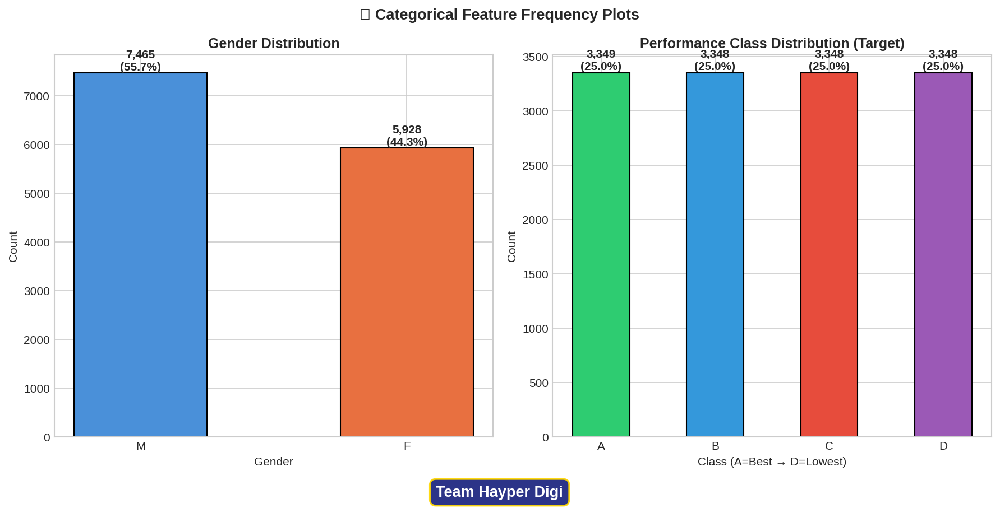
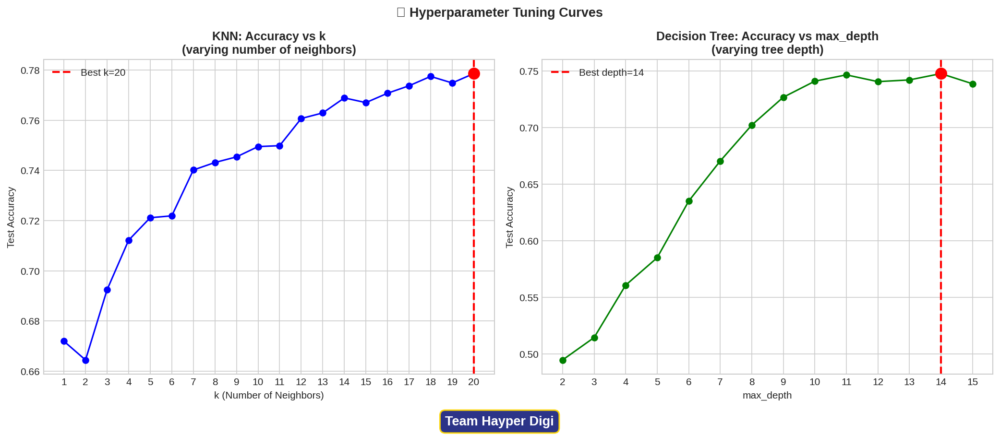
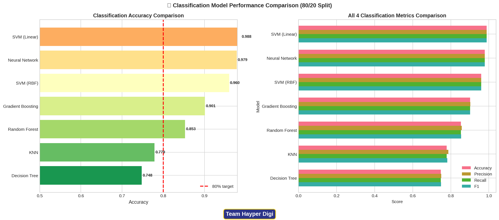
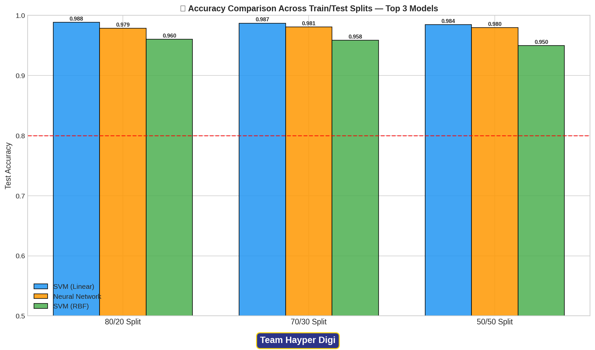
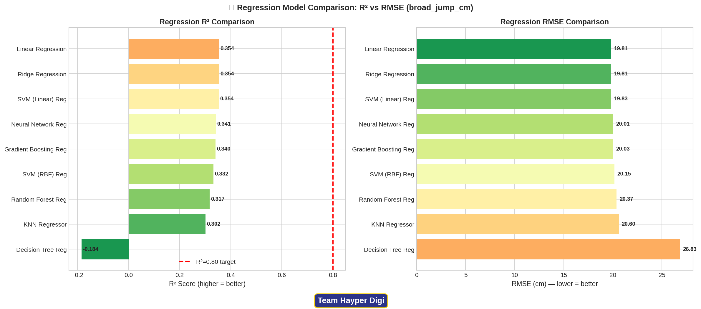

#                                   🏋️ Body Performance Intelligence System (Hayper Digi)
<p align="center">
  
</p>

#                                    🏋️ Body Performance Intelligence System (Hayper Digi)


An end-to-end Machine Learning pipeline to classify physical performance levels based on biometric data.

## 👥 Team Members (Hayper Digi)
- **Mohamed Khaled Mahmoud** (Team Leader)
- **Mohamed Eid Abdelkhalek**
- **Youssef Mohamed Elkoumy**
- **Moamen Essam Omar**
- **Mahmoud Maher**

---

## 📊 1. Exploratory Data Analysis (EDA)
We conducted a comprehensive EDA to uncover data distributions, anomalies, and relationships.

### Data Distributions & Outliers
<p align="center">
  
  
</p>
<p align="center">
  
</p>

### Feature Relationships & Importance
<p align="center">
  
  
</p>
<p align="center">
  
</p>

---

## ⚙️ 2. Hyperparameter Tuning
Optimizing our models to ensure the highest possible accuracy without overfitting.
<p align="center">
  
</p>

---

## 🏆 3. Classification Results
Evaluating our Machine Learning models on their ability to correctly classify physical performance into 4 distinct grades (A, B, C, D).

<p align="center">
  
  
</p>

### Confusion Matrices & Split Stability
Analyzing where our models succeed, where adjacent physiological classes overlap, and ensuring model stability across different Train/Test splits.
<p align="center">
  
  
</p>

---

## 📈 4. Regression Analysis
In addition to classification, we built regression models to predict exact physical output metrics (e.g., Broad Jump distance).
<p align="center">
  
  
</p>

---

## 📁 Repository Structure
```text
├── data/
│   └── bodyPerformance.csv
├── images/
│   ├── banner.png
│   ├── best_model_comparison_chart.jpg
│   ├── best_regressor_analysis.jpg
│   ├── boxplot_outliers.png
│   ├── categorical_distributions.png
│   ├── classification_comparison.png
│   ├── confusion_matrices.png
│   ├── correlation_heatmap.png
│   ├── feature_importance.png
│   ├── histogram_distributions.png
│   ├── hyperparameter_tuning.png
│   ├── regression_comparison.png
│   ├── scatter_plots.jpg
│   └── split_comparison.png
├── main.py
├── Body_Performance_Report.pdf
└── README.md